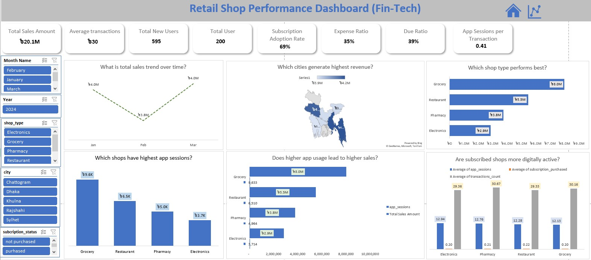
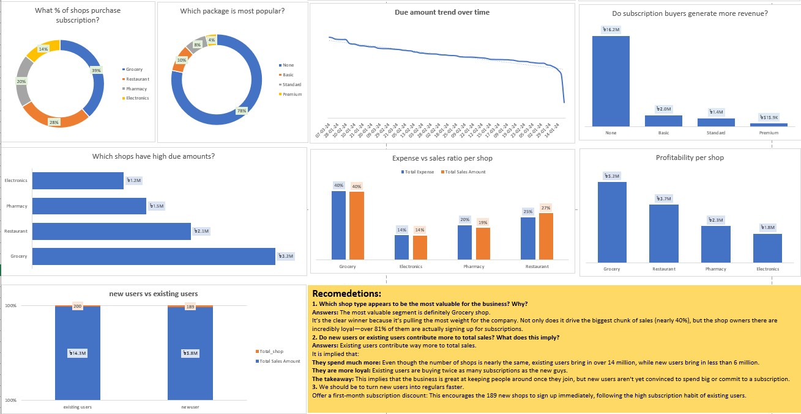

#Business & Retail Analytics Dashboards

Welcome to my portfolio of **Business Intelligence and Data Analytics projects**.  
These dashboards demonstrate my ability to transform raw data into actionable insights.

---

## 🚀 Projects Included

### 1. Shop Subscription & Revenue Dashboard
)

- **Key Insights:**
  - Grocery shops contribute the highest value (39% of subscriptions, $5.2M profitability).
  - Premium subscription package dominates (78% adoption).
  - Existing users generate significantly more revenue than new users.

---

### 2. Retail Shop Performance Dashboard (Fin-Tech)

- **Key Metrics (2024 Q1):**
  - Total Sales: ৳20.1M  
  - Subscription Adoption Rate: 69%  
  - Expense Ratio: 35%  
  - Due Ratio: 39%
- **City-Level Performance:**
  - Dhaka leads with ৳4.2M revenue.
  - Chattogram follows with ৳3.9M.
- **Shop-Type Performance:**
  - Grocery shops dominate with ৳8.0M sales and highest app engagement.

---

## 🛠️ Tools & Skills Demonstrated
- Excel

---

## 📈 Business Value
These dashboards provide:
- Clear visibility into **subscription adoption and profitability**.
- Insights into **user loyalty vs. acquisition challenges**.
- City and shop-type comparisons for **strategic resource allocation**.
- Evidence of how **digital engagement drives sales growth**.

---

## 👨‍💻 About Me
I’m **Muhammad**, a data analytics enthusiast with a background in **Statistics** and a passion for applying analytics to **business intelligence, e-commerce, and fintech**.
