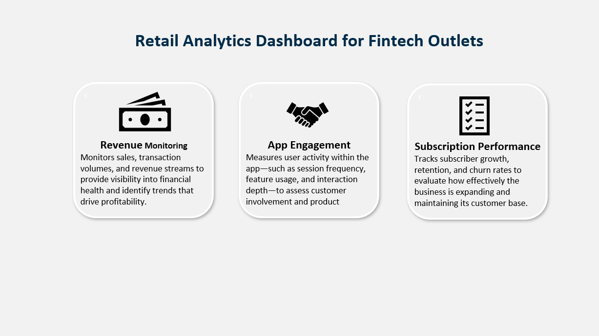
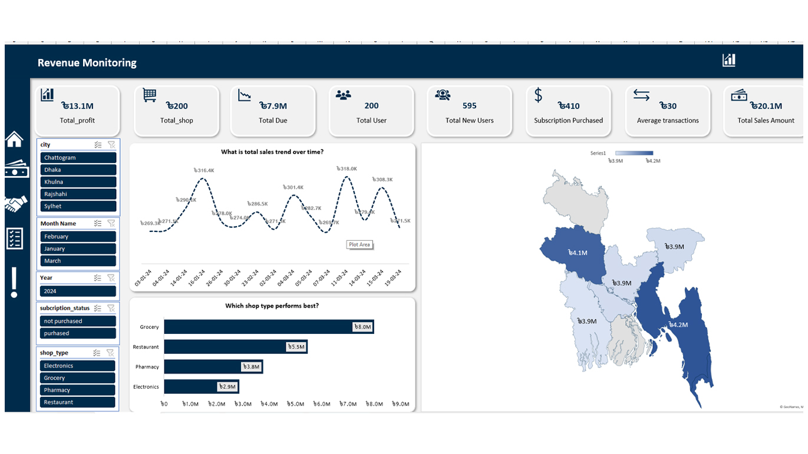
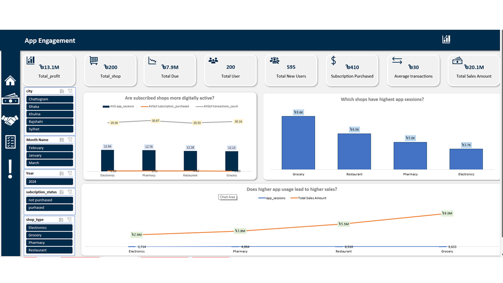
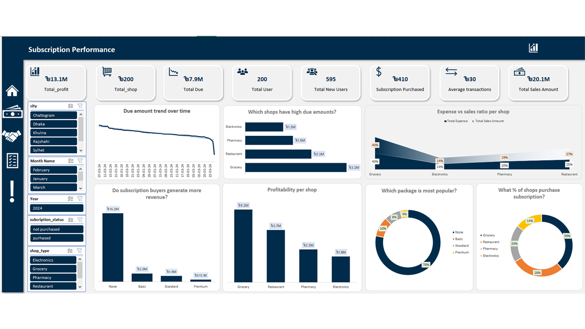

# Retail Analytics Dashboard for Fintech Outlets

A multi-layered business intelligence solution designed to monitor and optimize the performance of fintech-enabled retail shops. This dashboard translates complex transactional and engagement data into actionable insights across three core pillars: **Revenue**, **App Engagement**, and **Subscription Performance**.

---

## Project Overview
This dashboard provides a 360-degree view of the business ecosystem, focusing on 200 total shops across major cities like **Dhaka, Chattogram, Khulna**, etc. It enables stakeholders to track a total sales volume of **৳20.1M** and a total profit of **৳13.1M** with granular filtering capabilities.

---

## Core Dashboards & Features

### 1. Revenue Monitoring

- **Financial Health**: Real-time tracking of Total Profit (৳13.1M), Total Sales (৳20.1M), and Total Due (৳7.9M).  
- **Trend Analysis**: Visualizes sales fluctuations over time to identify seasonal peaks and troughs.  
- **Geospatial Insights**: Heatmaps showing sales distribution across regions; Chattogram and Dhaka lead in volume.  
- **Sector Performance**: Comparison of shop types (Grocery, Restaurant, Pharmacy, Electronics); Grocery leads with ৳8.0M in sales.

### 2. App Engagement

- **Usage Metrics**: Monitors session frequency and user activity depth.  
- **Correlation Analysis**: Explores the relationship between high app usage and sales performance.  
- **Segmented Engagement**: Breaks down average app sessions by shop type (Grocery shops show highest engagement at 9.6K sessions).  
- **Digital Activity**: Compares transaction counts against app sessions to measure "digital stickiness."

### 3. Subscription Performance

- **Growth Tracking**: Evaluates conversion of 200 total users into 410 purchased subscriptions (including renewals/multi-package buys).  
- **Package Popularity**: Breakdown of subscription tiers (Basic, Standard, Premium); 78% of users are currently on "None" (Free/Trial).  
- **Revenue Impact**: Directly compares revenue generated by "Subscribed" vs. "Non-Subscribed" shops.  
- **Financial Risk**: Tracks "Due Amount" trends over time to manage credit and collection health.

---

## Key Performance Indicators (KPIs)

| Metric | Value |
|--------|-------|
| Total Sales | ৳20.1M |
| Total Profit | ৳13.1M |
| Total Shops | 200 |
| Total New Users | 595 |
| Avg. Transactions | 30 |
| Total Due | ৳7.9M |

---

## Tech Stack & Tools
- **Data Visualization**: Excel  
- **Data Source**: Fintech Transaction Logs & User Engagement Databases  
- **Analysis**: Temporal trends, Geospatial mapping, and Segmented Profitability analysis  

---

## Business Impact
- **Identified Growth Levers**: Grocery outlets are highest revenue generators but require better subscription conversion.  
- **Debt Management**: Enabled tracking of ৳7.9M in dues to improve cash flow.  
- **User Retention**: Correlated app sessions with sales to demonstrate the value of the digital platform to shop owners.

---

